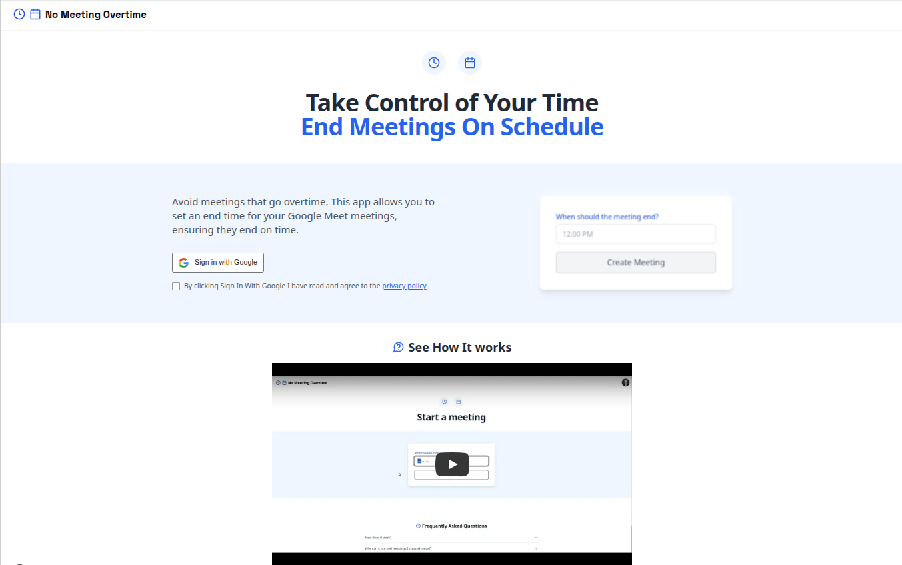

# No Meeting Overtime

https://no-meeting-overtime.click



## What This Project Does

No Meeting Overtime is a web application designed to help you manage your Google Meet meetings more effectively. It allows you to set a predefined end time for your meetings, ensuring they conclude on schedule and helping you avoid meetings that run over. Users can sign in with their Google account to create and manage these timed meetings.

## Technologies Used

*   **Frontend:**
    *   [Next.js](https://nextjs.org/) (React Framework)
    *   [React](https://reactjs.org/)
    *   [TypeScript](https://www.typescriptlang.org/)
    *   [Tailwind CSS](https://tailwindcss.com/)
*   **Backend & Services:**
    *   Google Meet APIs
    *   Google Cloud Firestore
*   **Development & Testing:**
    *   [Playwright](https://playwright.dev/) (for component testing)
    *   [Vitest](https://vitest.dev/) (for unit testing)
*   **Package Manager:**
    *   [pnpm](https://pnpm.io/) (deduced from `pnpm-lock.yaml`)

## How to Start the Project

To get the project running locally for development, follow these steps:

1.  **Install dependencies:**
    It's recommended to use `pnpm` as indicated by the `pnpm-lock.yaml` file.
    ```bash
    pnpm install
    ```
    *(If you prefer npm or yarn, you can try `npm install` or `yarn install`, but `pnpm` is preferred for consistency with the lock file.)*

3.  **Set up environment variables:**
    The google cloud libraries use ADC (application default credentials) for authentication: https://cloud.google.com/docs/authentication/application-default-credentials

4.  **Run the development server:**
    ```bash
    pnpm run dev
    ```
    This will start the Next.js development server
---

## Build and deploy locally

- Authenticate to the docker repository: https://cloud.google.com/artifact-registry/docs/docker/pushing-and-pulling#auth
- Make sure that your current configuration has an account linked: `gcloud config configuration list`
- Build: `docker build . -t europe-west1-docker.pkg.dev/no-meeting-overtime/repo/no-meeting-overtime:latest`
- Push: `docker push europe-west1-docker.pkg.dev/no-meeting-overtime/repo/no-meeting-overtime:latest`

## Environment Configuration

`PROJECT_ID` is the Google Cloud Project id

### Cloud Task configuration

- **Go to the [Google Cloud Console](https://console.cloud.google.com/).**
- **Select your project**
- Go to **IAM & Admin > Service Accounts**.
- Find the service account (e.g., `backend-app@no-meeting-overtime.iam.gserviceaccount.com`) and store it as `CLOUD_TASKS_SERVICE_ACCOUNT`
- Go to the **"Keys"** tab and create a new key and store the path to the service account key file in `KEY_FILE`
- Store the region of the queue in `QUEUE_LOCATION` (this is an input variable to terraform), its name is hardcoded in the terraform configuration
- The local dev server needs to be publicly available for Google Cloud Tasks to reach it (e.g. using ngrok). The public url must be stored in `SITE_BASE_CLOUD_TASKS`

### Google OAuth configuration

3. In the left sidebar, go to **APIs & Services > Credentials**.
4. Under **OAuth 2.0 Client IDs**, find your client (or create a new one by clicking **Create Credentials > OAuth client ID**).
5. Click on the client name to view details.
6. Copy the **Client ID** and **Client Secret** and paste them into your .env.local file as `CLIENT_ID` and `CLIENT_SECRET`.


## E2E Tests

They are a bit special, because they require an active Google login. An automated login is usually not possible, because of 2FA. Open a browser with `google-chrome-stable --remote-debugging-port=9222`. Make sure it doesn't respond with `Opening in existing browser session.`, meaning that a browser instance is already open. Login to a Google Account and set the email as env variable `GMAIL_USER`.
The tests cannot be started with the Playwright extension in vscode, because they always open a new browser window. Instead there are launch configurations.
For the tests to properly work, it is necesary to remove the check for a minimum meeting time with
```
NEXT_PUBLIC_MEETING_END_MINUTES_OFFSET="0"
```


Don't install glcoud from snap. You won't let you install the terraform extension
terraform can be installed from snap


`terraform plan`

`storage: object doesn't exist`? -> `gcloud auth application-default set-quota-project no-meeting-overtime`

`oauth2: "invalid_grant" "Token has been expired or revoked."`? -> `gcloud auth application-default login`

`failed precondition: due to quota restrictions, cannot run builds in this region, see https://cloud.google.com/build/docs/locations#restricted_regions_for_some_projects ` when building. Go to Quota > Cloud Build API > Concurrent Build CPUs (Regional Public Pool) per region per build_origin and request a value > 0